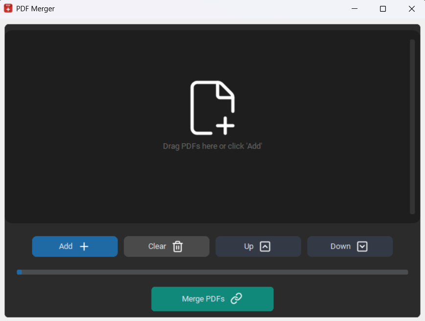

A modern, fast, and lightweight desktop utility to merge PDF files, built with Python and CustomTkinter. Avoid slow online tools or privacy-leaking websites; merge your documents locally with an intuitive and elegant interface.

## ✨ Features

Drag & Drop: Drop your PDF files directly into the application.

List Management: Add files, remove individual items via a dedicated "X" button, or clear the entire list.

Custom Ordering: Move files up or down to set the exact merging sequence.

Modern UI: Native Dark Mode with a minimalist design powered by CustomTkinter.

Safe & Private: All processing happens locally on your machine; your files never leave your computer.

