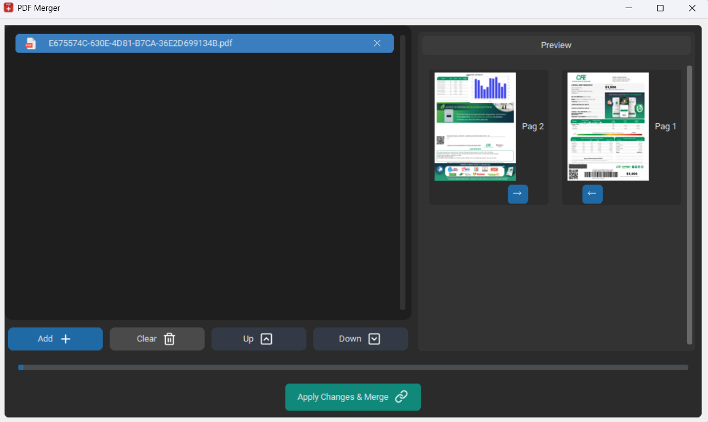

A powerful and minimalist desktop utility for surgical PDF manipulation. Designed for speed, precision, and total user privacy. Avoid slow online tools or privacy-leaking websites.

## ✨ Features

Real-Time Visualizer: Instant thumbnail generation for every page of the selected PDF.

Page Reordering: Change the internal sequence of pages within a file with a single click.

Selective Exclusion: Mark specific pages to be skipped during the merging process with a dedicated "Delete" mode (visualized in red).

Persistent Memory: Your custom order and excluded pages are saved automatically, even when switching between different files in your list.

Smart Controls: Intuitive movement arrows that hide automatically when a page is at the start/end of a list or marked for exclusion.

Drag & Drop: Drop your PDF files directly into the application to get started.

Global Sequence: Easily set the primary merging order by moving files up or down in the sidebar.

List Control: Individual "X" buttons for quick removal and a "Clear All" option for fresh starts.

Safe & Private: All processing happens locally on your machine; your files never leave your computer.

